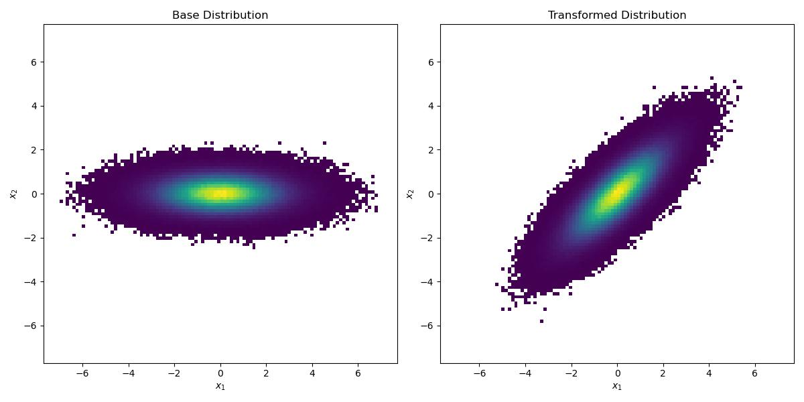
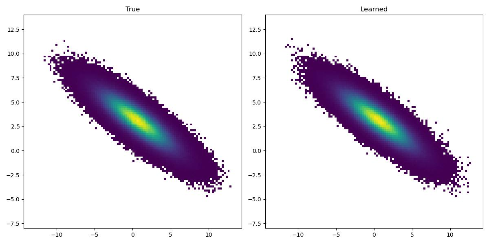
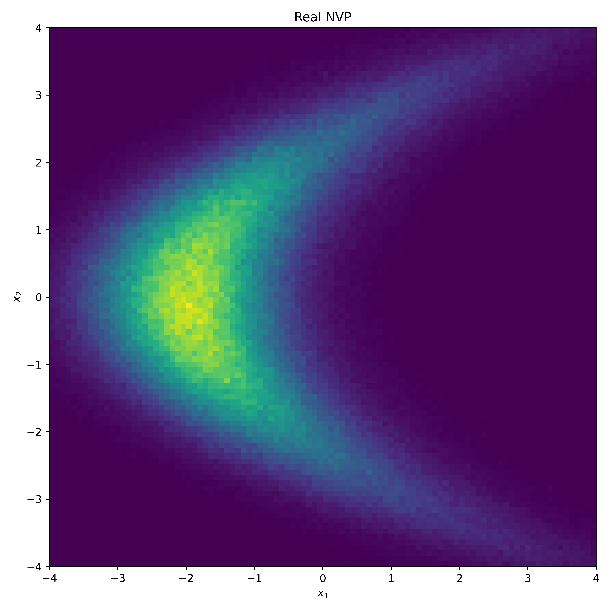
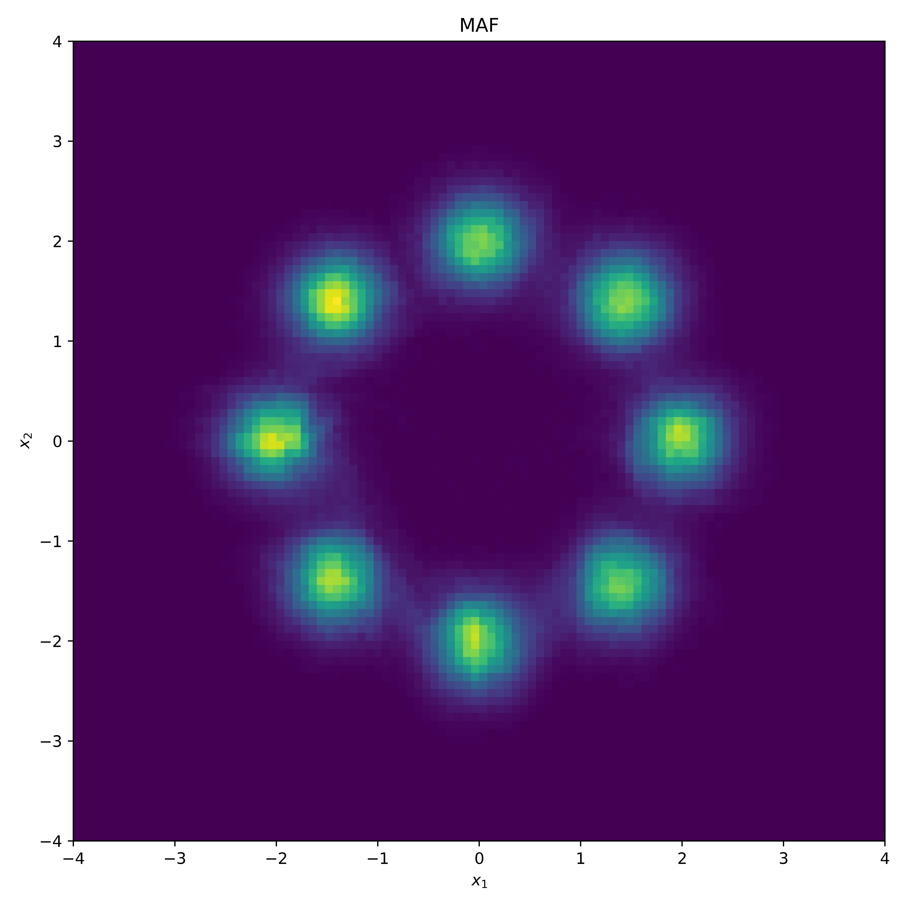
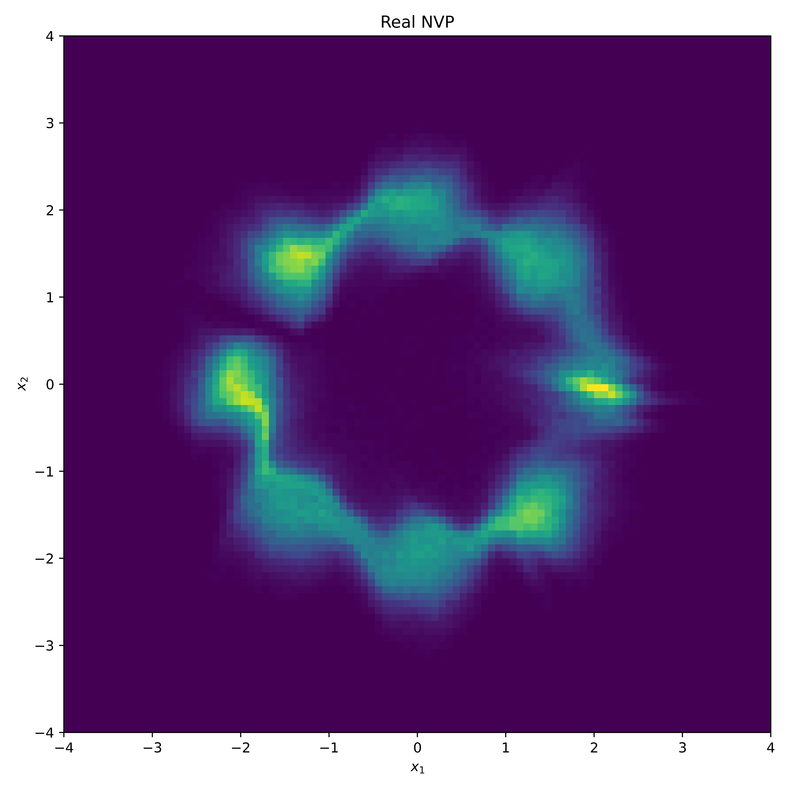
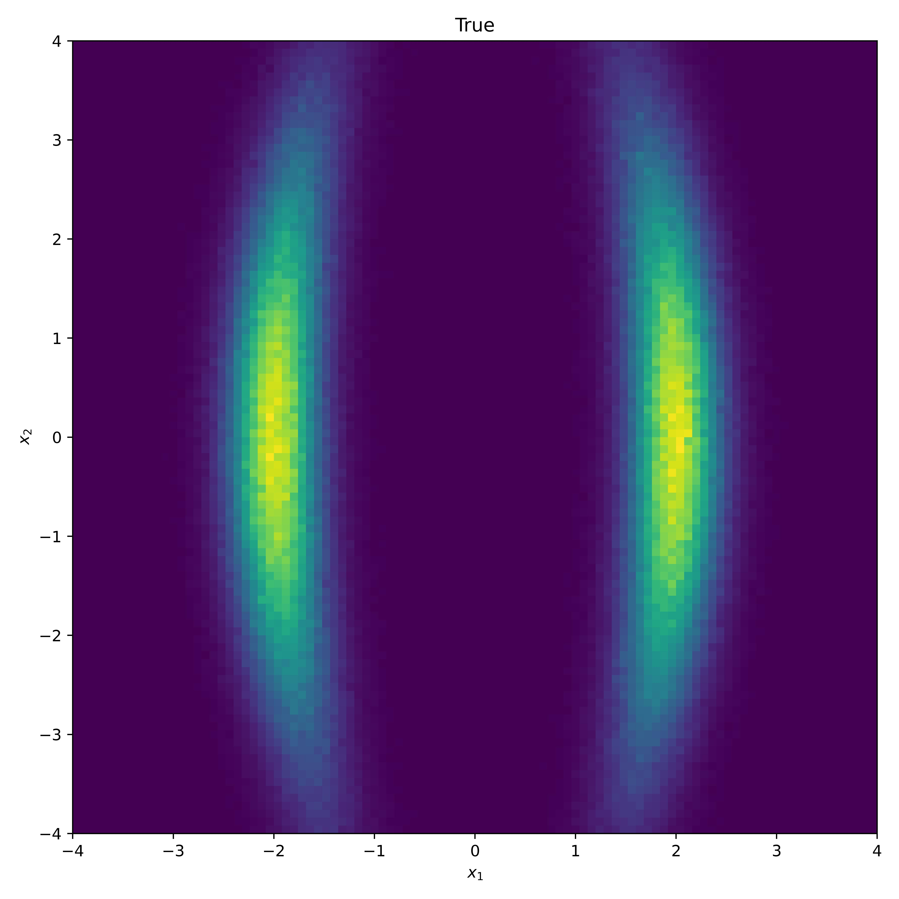
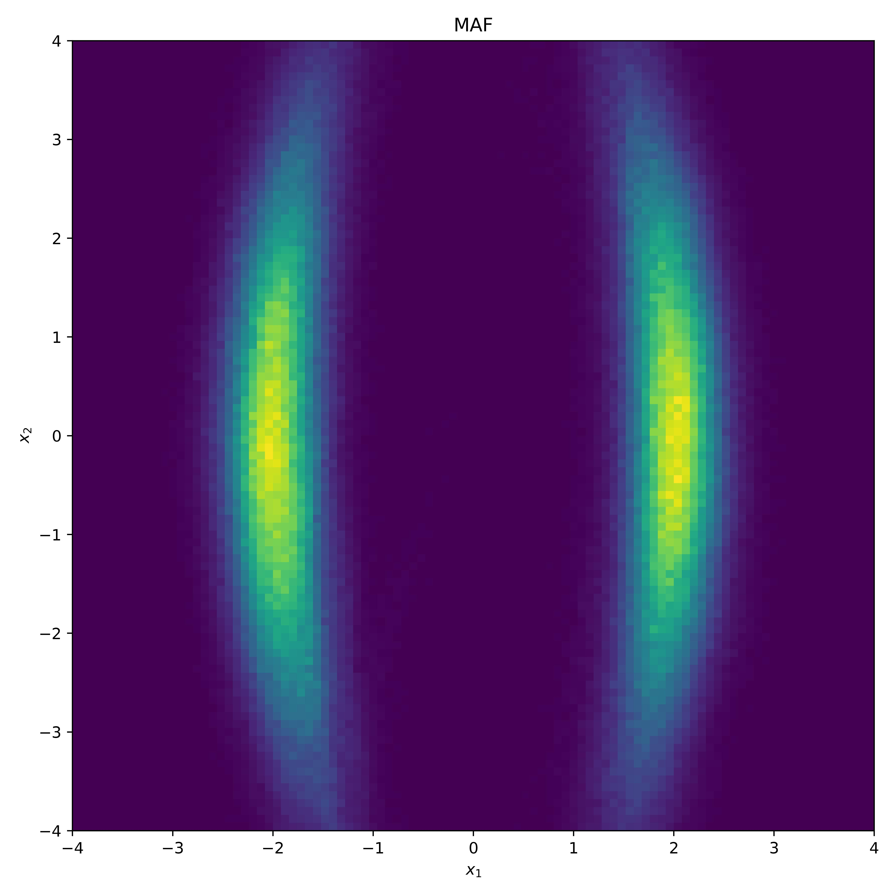
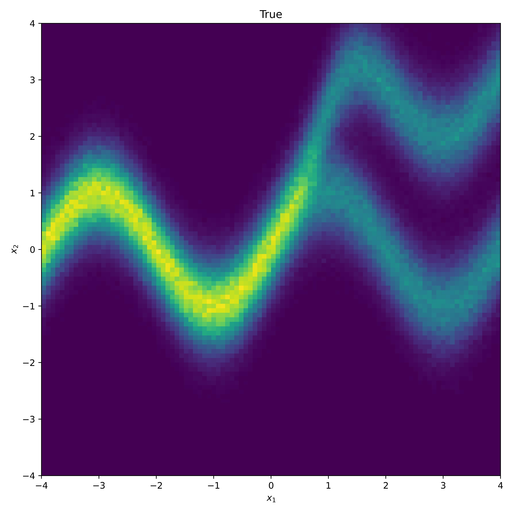
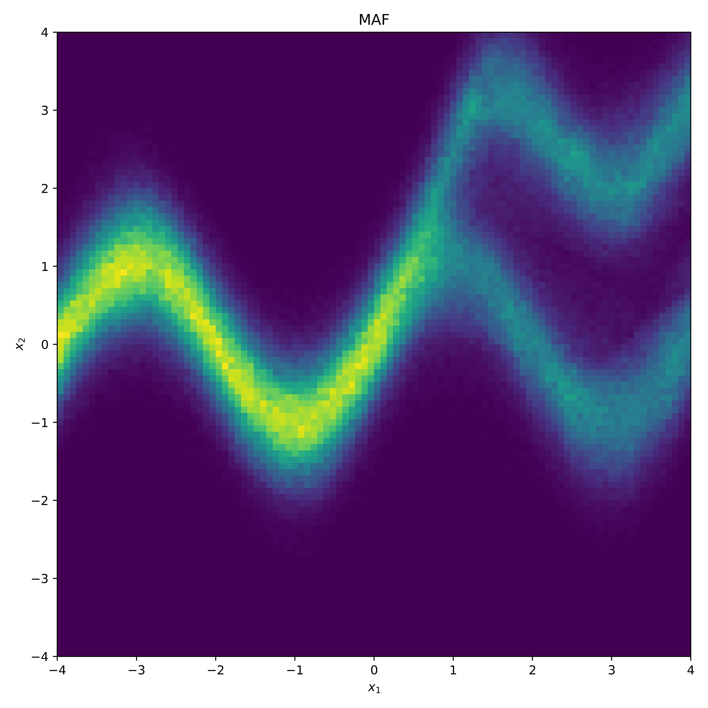
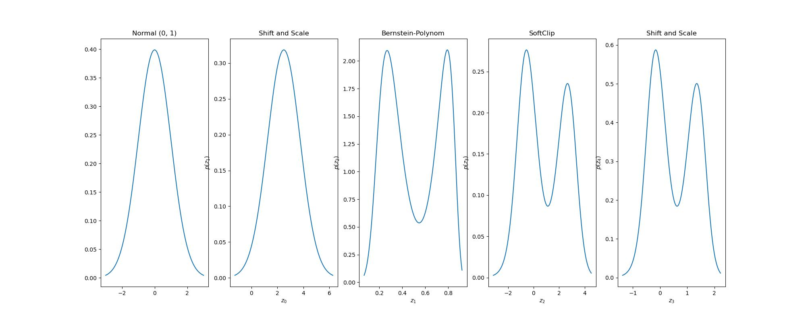

# Normalizing Flows


Example of a normalizing flow (Real NVP) learning the distribution on the left.

## Intro

> Normalizing flows operate by pushing a simple density through a series of transformations to produce a richer, potentially more multi-modal distribution.
> -- <cite>Papamakarios et al. 2021 </cite>

These transformations  have to be bijective, differentiable with a differentible inverse  and a functional determinant, in short  is a diffeomorphism (Note that in the NF literature the terms `Bijector` and `diffeomorphism` are used interchangably).

## Building a custom Bijector with distrax

We start with a linear map  given by:


with inverse  :


and functional determinant   .

In [distrax](https://github.com/deepmind/distrax) we can construct the above map by subclassing the `Bijector` class.

```python
import distrax
import jax.numpy as jnp

class OrthogonalProjection2D(distrax.Bijector):
    def __init__(self, theta):
        super().__init__(event_ndims_in=1, event_ndims_out=1)
        self.thetas = theta
        self.sin_theta = jnp.sin(theta)
        self.cos_theta = jnp.cos(theta)
        self.R = jnp.array(
            [[self.cos_theta, -self.sin_theta], [self.sin_theta, self.cos_theta]]
        ).T

    def forward(self, x):
        return jnp.matmul(x, self.R)

    def inverse(self, x):
        return jnp.matmul(x, self.R.T)

    def forward_and_log_det(self, x):
        y = self.forward(x)
        logdet = 1
        return y, logdet

    def inverse_and_log_det(self, x):
        y = self.inverse(x)
        logdet = 1
        return y, logdet
```

Transforming an independent multivariate Gaussian distribution  with the `OrthogonalProjection2D` for  yields a multivariate Gaussian distribution  which is no longer independent, as can be seen below:

Since the above bijector is linear we already knew that  where .

In the image below we chained shift, scale and the Orthogonal Projector.
On the left hand side the true distribution is depicted and on the right hand side the inferred ditribution using maximum likelihood for the shift parameter $a$, the scale parameter $b$ and the rotation parameter $\theta$:


## MAF & Real NVP & Glow

### samples from toy densities (left) and the inferred distribution with MAF (middle) and Real NVP (right)

|                           True                            |                          MAF                          |                          Real NVP                          |
| :-------------------------------------------------------: | :---------------------------------------------------: | :--------------------------------------------------------: |
|                  |                  |                  |
|  |  |  |
|                |                |                |
|                |                |                |
|                |                |                |
|                |                |                |

## Bernstein Flows

### Univariate



### Independent Multivariate


## Multiplicative Normalizing Flows

## HINT: Hierarchical Invertible Neural Transport

## Reference

- [Normalizing Flows for Probabilistic Modeling and Inference](https://arxiv.org/pdf/1912.02762.pdf) George Papamakarios, Eric Nalisnick, Danilo Jimenez Rezende, Shakir Mohamed, Balaji Lakshminarayanan
- [Density estimation using Real NVP](https://arxiv.org/abs/1605.08803) Laurent Dinh, Jascha Sohl-Dickstein, Samy Bengio
- [Deep transformation models: Tackling complex regression problems with neural network based transformation models](https://arxiv.org/pdf/2004.00464.pdf) Beate Sick, Torsten Hothorn, Oliver Dürr
- [Robust normalizing flows using Bernstein-type polynomials](https://arxiv.org/pdf/2102.03509.pdf) Sameera Ramasinghe, Kasun Fernando, Salman Khan, Nick Barnes
- [Building custom bijectors with Tensorflow Probability](https://romainlhardy.medium.com/building-custom-bijectors-with-tensorflow-probability-22241cb6a691)
