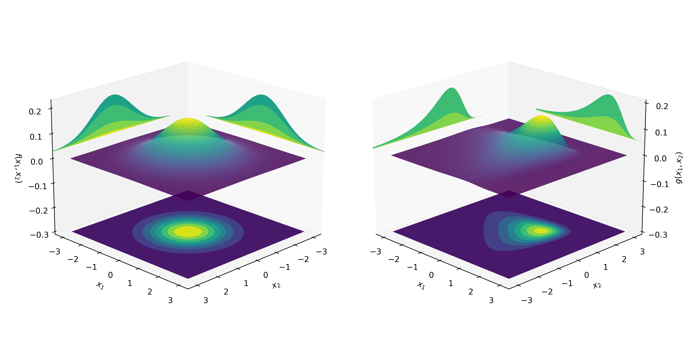
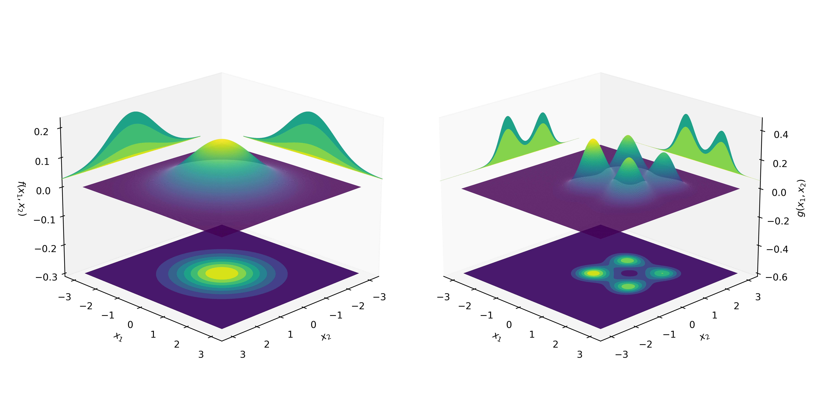

# Normalizing Flows


## Custom Bijector with distrax

```python
import distrax
import jax.numpy as jnp

class OrthogonalProjection2D(distrax.Bijector):
    def __init__(self, theta):
        super().__init__(event_ndims_in=1, event_ndims_out=1)
        self.thetas = theta
        self.sin_theta = jnp.sin(theta)
        self.cos_theta = jnp.cos(theta)
        self.R = jnp.array(
            [[self.cos_theta, -self.sin_theta], [self.sin_theta, self.cos_theta]]
        ).T

    def forward(self, x):
        return jnp.matmul(x, self.R)

    def inverse(self, x):
        return jnp.matmul(x, self.R.T)

    def forward_and_log_det(self, x):
        y = self.forward(x)
        logdet = 1
        return y, logdet

    def inverse_and_log_det(self, x):
        y = self.inverse(x)
        logdet = 1
        return y, logdet
```

Chaining the above bijector with shift, scale and log yields the following transformed distribution.


## MAF


## Bernstein Flows

### Univariate


### Independent Multivariate



## Reference

- [Deep transformation models: Tackling complex regression problems with neural network based transformation models](https://arxiv.org/pdf/2004.00464.pdf) Beate Sick, Torsten Hothorn, Oliver Dürr
- [Robust normalizing flows using Bernstein-type polynomials](https://arxiv.org/pdf/2102.03509.pdf) Sameera Ramasinghe, Kasun Fernando, Salman Khan, Nick Barnes
- [Building custom bijectors with Tensorflow Probability](https://romainlhardy.medium.com/building-custom-bijectors-with-tensorflow-probability-22241cb6a691)
